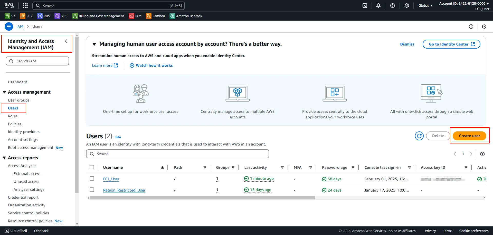
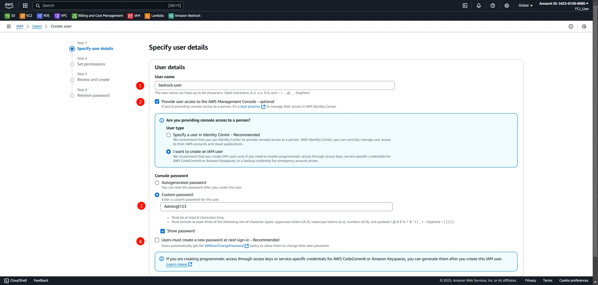
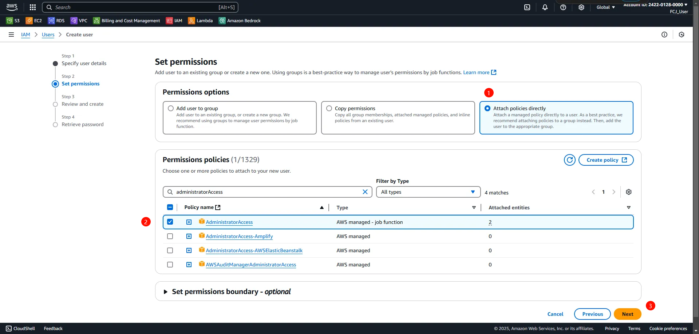
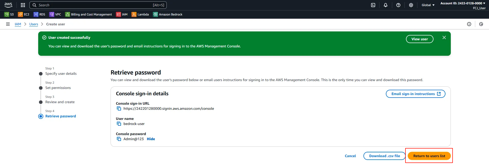
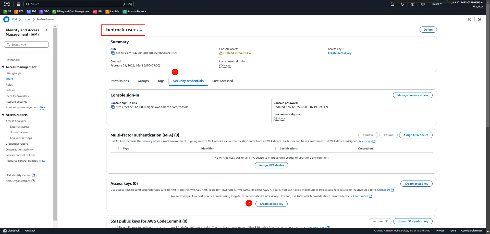
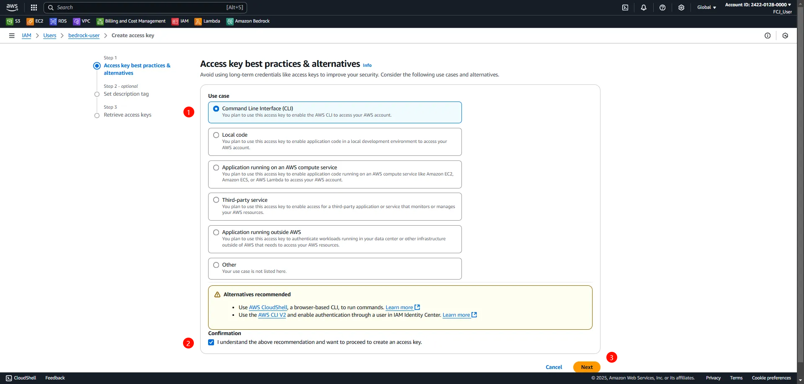
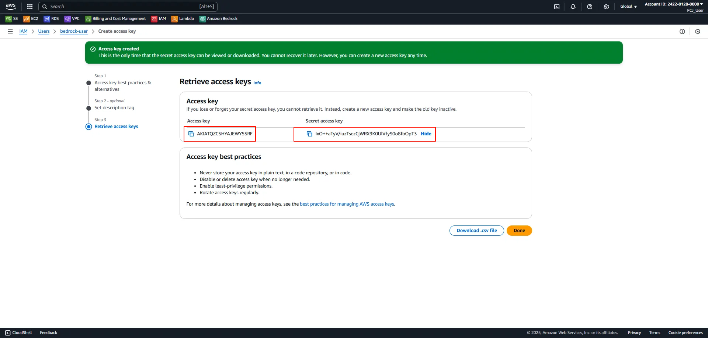

#### Bước 1: Đăng nhập vào AWS Management Console
Đăng nhập vào AWS Management Console bằng tài khoản Root User hoặc tài khoản có quyền quản trị (admin).

#### Bước 2: Truy cập vào dịch vụ Identity and Access Management (IAM)
Sau khi đăng nhập thành công, truy cập vào dịch vụ **Identity and Access Management** (IAM) từ giao diện chính của Console.

#### Bước 3: Tạo người dùng mới
1. Trong giao diện IAM, vào tab **Users** và chọn **Create user**.
2. Trong giao diện **Specify user details**, nhập tên người dùng vào trường **User name**.
3. Chọn **Provide user access to the AWS Management Console**.
4. Tại mục **Console Password**, chọn **Custom Password** và nhập mật khẩu mong muốn cho người dùng.
5. Bỏ chọn **User must create a new password at next sign-in** nếu không yêu cầu người dùng thay đổi mật khẩu khi đăng nhập lần đầu.
6. Chọn **Next** để tiếp tục.

#### Bước 4: Cấu hình quyền truy cập
1. Trong giao diện **Set Permissions**, chọn policy `AdministratorAccess` để cấp quyền truy cập đầy đủ cho người dùng.
2. Chọn **Next** để tiếp tục.

#### Bước 5: Xác nhận việc tạo người dùng thành công
Kiểm tra kết quả và xác nhận người dùng đã được tạo thành công.

#### Bước 6: Tạo Access Key cho người dùng
1. Nhấn vào tên người dùng vừa tạo.
2. Chuyển đến tab **Security Credentials**.
3. Tại mục **Access Keys**, chọn **Create access key**.

#### Bước 7: Lưu trữ Access Key và Secret Key
1. Tại giao diện **Access key best practices & alternatives**, chọn use case **Command Line Interface (CLI)**.
2. Chọn **Next** để tiếp tục.

3. Lưu trữ **Access Key** và **Secret Key** được hiển thị trong giao diện **Retrieve Access Key** để sử dụng trong các ứng dụng hoặc công cụ liên quan.

