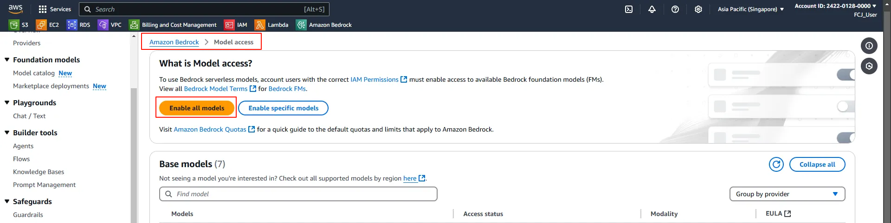
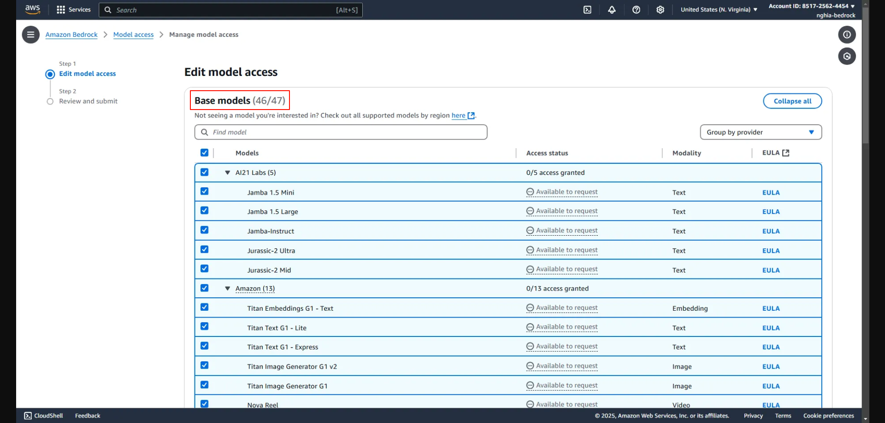
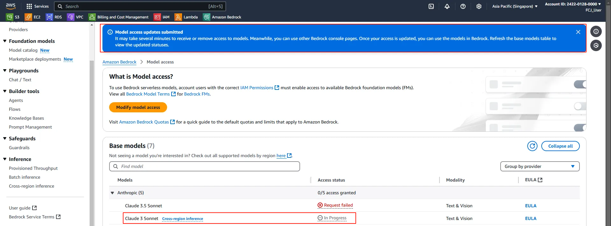

#### **2.2. Cấu hình truy cập Bedrock Foundation Models**

Để sử dụng Agent có thể sử dụng models, chúng ta cần phải request access tới model cần sử dụng

Truy cập Amazon Bedrock service, tại tab **Bedrock configurations** > chọn **Model Access** > Chọn **Enable All Models** hoặc **Enable Specific Models**

Tại giao diện **Step 1: Edit model access**, tại **Base models** tìm kiếm, chọn **Claude 3 Sonnet** > Next

**Step 2: Review and Submit** > **Submit** hoàn thành

