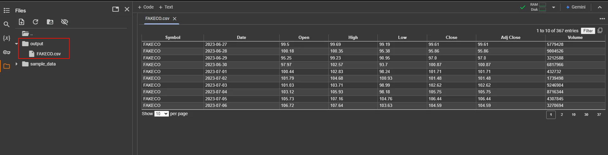

Chúng ta sẽ tạo một tệp CSV chứa dữ liệu giá cổ phiếu của công ty giả định 'FAKECO' để phục vụ mục đích minh họa.

```python
import pandas as pd
import numpy as np
from datetime import datetime, timedelta
def make_synthetic_stock_data(filename):
    # Define the start and end dates
    start_date = datetime(2023, 6, 27)
    end_date = datetime(2024, 6, 27)

    # Create a date range
    date_range = pd.date_range(start_date, end_date, freq='D')

    # Initialize lists to store the data
    symbol = []
    dates = []
    open_prices = []
    high_prices = []
    low_prices = []
    close_prices = []
    adj_close_prices = []
    volumes = []

    # Set the initial stock price
    initial_price = 100.0

    # Generate plausible stock prices
    for date in date_range:
        symbol.append('FAKECO')
        dates.append(date)
        open_price = np.round(initial_price + np.random.uniform(-1, 1), 2)
        high_price = np.round(open_price + np.random.uniform(0, 5), 2)
        low_price = np.round(open_price - np.random.uniform(0, 5), 2)
        close_price = np.round(np.random.uniform(low_price, high_price), 2)
        adj_close_price = close_price
        volume = np.random.randint(1000, 10000000)

        open_prices.append(open_price)
        high_prices.append(high_price)
        low_prices.append(low_price)
        close_prices.append(close_price)
        adj_close_prices.append(adj_close_price)
        volumes.append(volume)

        initial_price = close_price

    # Create a DataFrame
    data = {
        'Symbol': symbol,
        'Date': dates,
        'Open': open_prices,
        'High': high_prices,
        'Low': low_prices,
        'Close': close_prices,
        'Adj Close': adj_close_prices,
        'Volume': volumes
    }

    stock_data = pd.DataFrame(data)

    # Save the dataframe
    stock_data.to_csv(filename, index=False)
```

```python
# Insure the output directory exists
import os
if not os.path.exists('output'):
    os.makedirs('output')

stock_file = os.path.join('output', 'FAKECO.csv')
if not os.path.exists(stock_file):
    make_synthetic_stock_data(stock_file)
```

#### 1️⃣ **Tạo Dữ Liệu Giả Lập Cổ Phiếu FAKECO**  
- Sử dụng thư viện `pandas`, `numpy` và `datetime` để tạo dữ liệu chứng khoán cho công ty giả định **FAKECO**.
- Dữ liệu bao gồm: **ngày giao dịch, giá mở cửa, giá cao nhất, giá thấp nhất, giá đóng cửa, giá điều chỉnh, và khối lượng giao dịch**.
- Phạm vi thời gian: **từ 27/06/2023 đến 27/06/2024**.

#### 2️⃣ **Tạo Giá Cổ Phiếu Biến Động Ngẫu Nhiên**  
- **Mức giá ban đầu**: `100.0 USD`.  
- Mỗi ngày, giá **mở cửa, cao nhất, thấp nhất, và đóng cửa** được tạo ngẫu nhiên dựa trên biến động thực tế của thị trường.  
- **Khối lượng giao dịch**: ngẫu nhiên từ **1,000 đến 10,000,000**.  
- Dữ liệu được lưu vào **DataFrame của pandas**.

#### 3️⃣ **Lưu Dữ Liệu Thành File CSV**  
- Tệp CSV sẽ được tạo trong thư mục `output/FAKECO.csv`.  
- Nếu thư mục chưa tồn tại, nó sẽ được tạo tự động.  
- Nếu tệp chưa có, chương trình sẽ sinh dữ liệu mới và lưu lại.



