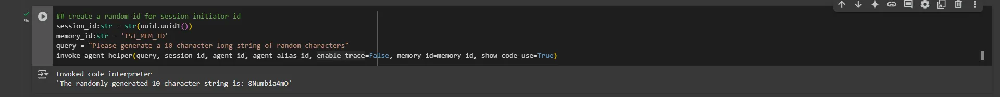
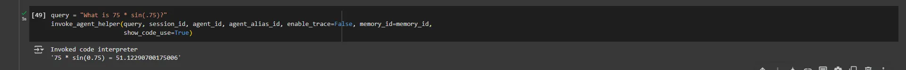
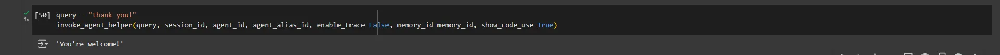

#### Thực Thi Trình Biên Dịch Code

Chúng ta yêu cầu agent tạo một chuỗi ngẫu nhiên, điều này sẽ bắt buộc agent sử dụng code interpreter. Sử dụng flag `show_code_use`, chúng ta có thể thấy agent invoke code interpreter để evaluate Python code mà nó tạo ra.

```python
## create a random id for session initiator id
session_id:str = str(uuid.uuid1())
memory_id:str = 'TST_MEM_ID'
query = "Please generate a 10 character long string of random characters"
invoke_agent_helper(query, session_id, agent_id, agent_alias_id, enable_trace=False, memory_id=memory_id, show_code_use=True)
```



Tương tự, agent sẽ viết Python code và invoke code interpreter để giải bài toán toán học

```python
query = "What is 75 * sin(.75)?"
invoke_agent_helper(query, session_id, agent_id, agent_alias_id, enable_trace=False, memory_id=memory_id,
                    show_code_use=True)
```


Ngược lại, các thao tác khác mà model không cần thực thi code sẽ không invoke code interpreter

```python
query = "thank you!"
invoke_agent_helper(query, session_id, agent_id, agent_alias_id, enable_trace=False, memory_id=memory_id, show_code_use=True)
```

