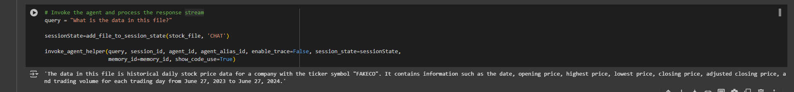
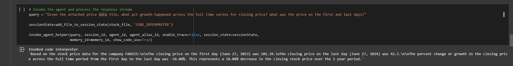

---  
title: "Gửi files cho Agent"  
weight: 2  
chapter: false  
pre: " <b> 4.2. </b> "  
---  

#### **Gửi files cho Agent**

Chúng ta có thể gửi files cho Agent để sử dụng trong cuộc trò chuyện bình thường hoặc với code interpreter. Để gửi files, ta gán chúng vào session state.  

#### **Định nghĩa các hàm hỗ trợ**

Chúng ta sẽ định nghĩa các hàm hỗ trợ để xử lý các loại file khác nhau, thiết lập đúng kiểu media, gọi Agent và xử lý phản hồi.  

Hàm hỗ trợ dưới đây sẽ thêm files vào session state. Files được truyền qua session state, mỗi file sẽ có các thông tin sau:  

- **name** (tên file)  
- **sourceType** (‘s3’ hoặc ‘byte_content’ nếu là file cục bộ)  
- **mediaType** (hỗ trợ các định dạng: CSV, XLS, XLSX, YAML, JSON, DOC, DOCX, HTML, MD, TXT, PDF)  
- **data** (dữ liệu của file)  
- **useCase** (chỉ định cách model sử dụng file: `CHAT` hoặc `CODE_INTERPRETER`)  

Tham khảo thêm tài liệu về [session state](https://docs.aws.amazon.com/bedrock/latest/userguide/Agents-test-code-interpretation.html) để biết chi tiết.  

```python
# Trả về session state chứa danh sách files đã thêm vào
def add_file_to_session_state(file_name, use_case='CODE_INTERPRETER', session_state=None):
    if use_case not in ["CHAT", "CODE_INTERPRETER"]:
        raise ValueError("Use case phải là 'CHAT' hoặc 'CODE_INTERPRETER'")
    if not session_state:
        session_state = {"files": []}

    type = file_name.split(".")[-1].upper()
    name = file_name.split("/")[-1]

    if type == "CSV":
        media_type = "text/csv" 
    elif type in ["XLS", "XLSX"]:
        media_type = "application/vnd.openxmlformats-officedocument.spreadsheetml.sheet"
    else:
        media_type = "text/plain"

    named_file = {
        "name": name,
        "source": {
            "sourceType": "BYTE_CONTENT", 
            "byteContent": {
                "mediaType": media_type,
                "data": open(file_name, "rb").read()
            }
        },
        "useCase": use_case
    }
    session_state['files'].append(named_file)

    return session_state
```  

#### **Truyền tệp để sử dụng với Normal Chat ( không cần thực thi code )**

Trong trường hợp này, ta gửi một file CSV cục bộ và yêu cầu model giải thích dữ liệu trong file. Khi thêm file vào session state, ta đặt `useCase='CHAT'` thay vì `'CODE_INTERPRETER'`. Ngoài ra, ta bật `show_code_use=True` để kiểm tra xem model có sử dụng code interpreter hay không. Kết quả cho thấy model không sử dụng code interpreter mà đánh giá thông tin dựa trên khả năng hiểu ngôn ngữ tự nhiên của nó.  

Trước tiên, ta kiểm tra nội dung file. File chứa danh sách giá lịch sử của một cổ phiếu.  

```python
import base64 

# Mã hóa file CSV dưới dạng base64
with open(stock_file, "rb") as file_name:
    data = file_name.read()
    encoded_file = data  # base64.b64encode(data)

# Hiển thị 100 ký tự đầu tiên của file đã mã hóa
encoded_file[0:100]
```  

Tiếp theo, ta gọi Agent để phân tích dữ liệu trong file và cung cấp thông tin. Agent sẽ nhận diện dữ liệu trong file (có chứa dữ liệu giá cổ phiếu giả lập của 'FAKECO'), sau đó phản hồi về loại dữ liệu và phạm vi ngày của dữ liệu. Lưu ý rằng Agent không cần sử dụng code interpreter để thực hiện nhiệm vụ này.  

```python
# Invoke the agent and process the response stream
query = "What is the data in this file?"

sessionState=add_file_to_session_state(stock_file, 'CHAT')

invoke_agent_helper(query, session_id, agent_id, agent_alias_id, enable_trace=False, session_state=sessionState,
                    memory_id=memory_id, show_code_use=True)
```



#### **Truyền tệp để sử dụng với Code Interpreter**  

Bây giờ, khi chúng ta đã biết nội dung của tệp là dữ liệu chứng khoán, chúng ta có thể đặt các câu hỏi tài chính về nó. Điều này sẽ yêu cầu model gọi **Code Interpreter**.  

Ở đây, chúng ta sẽ khởi tạo lại dữ liệu session và chỉ định **use case** là `'CODE_INTERPRETER'`.

```python
# Gọi Agent và xử lý phản hồi
query = "Dựa vào file dữ liệu giá kèm theo, tổng mức tăng trưởng phần trăm của giá đóng cửa trong toàn bộ chuỗi thời gian là bao nhiêu? Giá vào ngày đầu tiên và ngày cuối cùng là bao nhiêu?"

sessionState = add_file_to_session_state(stock_file, 'CODE_INTERPRETER')

invoke_Agent_helper(query, session_id, Agent_id, Agent_alias_id, enable_trace=False, session_state=sessionState,
                    memory_id=memory_id, show_code_use=True)
```

