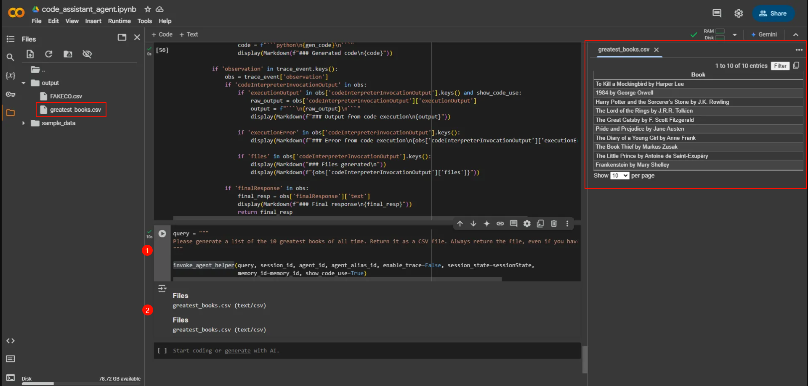
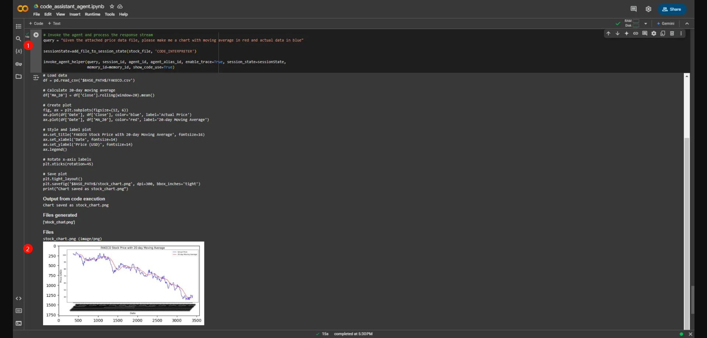
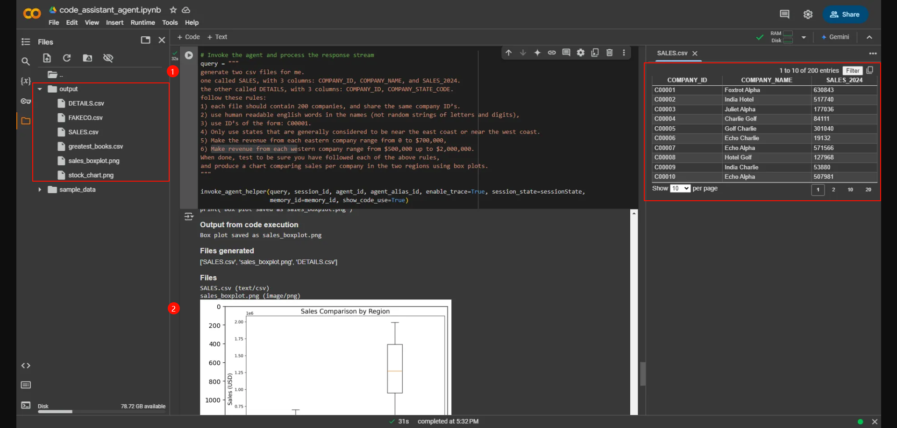

#### **Tạo file với trình thông dịch mã**

Các Agent Amazon Bedrock cũng có thể tạo và trả lại file cho người dùng. Chúng có thể tạo file bằng cách sử dụng trí thông minh gốc của mô hình để tạo các loại file, như file .CSV, hoặc bằng cách Agent viết mã sử dụng trình thông dịch mã để tạo các file nhị phân, như biểu đồ dữ liệu. Các Agent trả lại file trong dòng phản hồi.

#### **Dòng phản hồi của Agent Bedrock**

Dòng phản hồi bao gồm các sự kiện, được định dạng theo JSON. Nó truyền tải dữ liệu chi tiết về quá trình suy nghĩ và hành động của Agent khi thực hiện theo [mô hình ReAct](https://aws.amazon.com/blogs/aws/preview-enable-foundation-models-to-complete-tasks-with-agents-for-amazon-bedrock/) (suy luận và hành động). Dưới đây là một số khóa quan trọng:

- 'files' chứa các file được tạo ra bởi mô hình LLM của Agent một cách tự nhiên
- 'trace' chứa thông tin về quá trình suy nghĩ và các bước công việc của Agent. Có nhiều loại sự kiện trace:
    - 'modelInvocationInput' chứa
    - 'rationale' chứa lý do của Agent
    - 'invocationInput' chứa chi tiết về các tham số gọi nhóm hành động.
        - 'codeInterpreterInvocationInput' chứa mã mà mô hình đã tạo và đang chuyển sang trình thông dịch mã.
    - 'observation' chứa các quan sát quan trọng, bao gồm:
        - 'codeInterpreterInvocationOutput' chứa đầu ra cụ thể từ việc thông dịch mã:
            - 'executionOutput' chứa kết quả của việc thực thi mã
            - 'executionError' chứa lỗi nếu có lỗi xảy ra khi thực thi mã
            - 'files' chứa các file được tạo ra từ việc thông dịch mã
        - 'finalResponse' chứa phản hồi cuối cùng của Agent

Chúng ta sẽ định nghĩa lại hàm trợ giúp của mình để bắt các kết quả file từ dòng phản hồi. Sau đó, chúng ta sẽ sử dụng nó để lưu các file được tạo ra bởi Agent, dù thông qua trí thông minh của nó hay sử dụng thông dịch mã, và trả lại cho người dùng.

#### **Định nghĩa lại hàm trợ giúp**

Chúng ta sẽ định nghĩa lại hàm trợ giúp `process_response` để có thể bắt và hiển thị chi tiết phong phú hơn từ dòng phản hồi. Ở đây, chúng ta nhập IPython.display để nếu chạy trong một notebook có đầu ra hiển thị phong phú như Markdown, nó có thể hiển thị tương tác của Agent tốt hơn, chẳng hạn như nhúng các file trả lại để hiển thị. Chúng ta cần nhập thêm thư viện để xử lý notebook và hình ảnh.

```python
from IPython.display import display, Markdown
import matplotlib.pyplot as plt
import matplotlib.image as mpimg
```

```python
def process_response(resp, enable_trace:bool=True, show_code_use:bool=False):
    if resp['ResponseMetadata']['HTTPStatusCode'] != 200:
        print(f"API Response was not 200: {resp}")

    event_stream = resp['completion']
    for event in event_stream:
        if 'files' in event.keys():
            files_event = event['files']
            display(Markdown("### Files"))
            files_list = files_event['files']
            for this_file in files_list:
                print(f"{this_file['name']} ({this_file['type']})")
                file_bytes = this_file['bytes']

                # Lưu byte vào file, với tên file và byte 
                file_name = os.path.join('output', this_file['name'])
                with open(file_name, 'wb') as f:
                    f.write(file_bytes)
                if this_file['type'] == 'image/png' or this_file['type'] == 'image/jpeg':
                    img = mpimg.imread(file_name)
                    plt.imshow(img)
                    plt.show()

        if 'trace' in event.keys() and enable_trace:
            trace_event = event.get('trace')['trace']['orchestrationTrace']

            if 'modelInvocationInput' in trace_event.keys():
                pass

            if 'rationale' in trace_event.keys():
                rationale = trace_event['rationale']['text']
                display(Markdown(f"### Rationale\n{rationale}"))

            if 'invocationInput' in trace_event.keys() and show_code_use:
                inv_input = trace_event['invocationInput']
                if 'codeInterpreterInvocationInput' in inv_input:
                    gen_code = inv_input['codeInterpreterInvocationInput']['code']
                    code = f"```python\n{gen_code}\n```"
                    display(Markdown(f"### Generated code\n{code}"))

            if 'observation' in trace_event.keys():
                obs = trace_event['observation']
                if 'codeInterpreterInvocationOutput' in obs:
                    if 'executionOutput' in obs['codeInterpreterInvocationOutput'].keys() and show_code_use:
                        raw_output = obs['codeInterpreterInvocationOutput']['executionOutput']
                        output = f"```\n{raw_output}\n```"
                        display(Markdown(f"### Output from code execution\n{output}"))

                    if 'executionError' in obs['codeInterpreterInvocationOutput'].keys():
                        display(Markdown(f"### Error from code execution\n{obs['codeInterpreterInvocationOutput']['executionError']}"))

                    if 'files' in obs['codeInterpreterInvocationOutput'].keys():
                        display(Markdown("### Files generated\n"))
                        display(Markdown(f"{obs['codeInterpreterInvocationOutput']['files']}"))

                if 'finalResponse' in obs:                    
                    final_resp = obs['finalResponse']['text']
                    display(Markdown(f"### Final response\n{final_resp}"))
                    return final_resp
```

#### **Tạo file bằng cách sinh mã**

Chúng ta sẽ yêu cầu Agent tạo một file, mà nó sẽ trả lại qua dòng phản hồi.

```python
query = """
Please generate a list of the 10 greatest books of all time. Return it as a CSV file. Always return the file, even if you have provided it before.
"""

invoke_agent_helper(query, session_id, agent_id, agent_alias_id, enable_trace=False, session_state=sessionState,
                    memory_id=memory_id, show_code_use=True)
```



#### **Tạo biểu đồ bằng cách thông dịch mã**

Chúng ta sẽ gửi cùng một file dữ liệu giá cổ phiếu như trước, nhưng lần này yêu cầu một biểu đồ. Agent của chúng ta sẽ cần viết mã Python để tạo biểu đồ. Trình phân tích dòng phản hồi được tăng cường bằng markdown sẽ hiển thị biểu đồ vào trong notebook.

```python
# Gọi Agent và xử lý dòng phản hồi
query = "Given the attached price data file, please make me a chart with moving average in red and actual data in blue"

sessionState=add_file_to_session_state(stock_file, 'CODE_INTERPRETER')

invoke_agent_helper(query, session_id, agent_id, agent_alias_id, enable_trace=True, session_state=sessionState,
                    memory_id=memory_id, show_code_use=True)
```


#### **Tạo dữ liệu tổng hợp và phân tích**

```python
# Gọi Agent và xử lý dòng phản hồi
query = """
generate two csv files for me. 
one called SALES, with 3 columns: COMPANY_ID, COMPANY_NAME, and SALES_2024. 
the other called DETAILS, with 3 columns: COMPANY_ID, COMPANY_STATE_CODE. 
follow these rules:
1) each file should contain 200 companies, and share the same company ID’s. 
2) use human readable english words in the names (not random strings of letters and digits), 
3) use ID’s of the form: C00001. 
4) Only use states that are generally considered to be near the east coast or near the west coast. 
5) Make the revenue from each eastern company range from 0 to $700,000, 
6) Make revenue from each western company range from $500,000 up to $2,000,000. 
When done, test to be sure you have followed each of the above rules, 
and produce a chart comparing sales per company in the two regions using box plots.
"""

invoke_agent_helper(query, session_id, agent_id, agent_alias_id, enable_trace=True, session_state=sessionState,
                    memory_id=memory_id, show_code_use=True)
```

