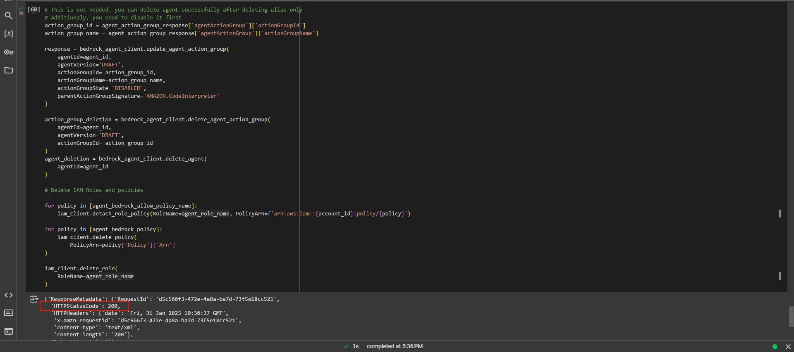

Bạn có thể tùy chọn dọn dẹp các tài nguyên đã tạo.

```python
# Không bắt buộc, bạn có thể xóa agent sau khi đã xóa alias
# Ngoài ra, bạn cần vô hiệu hóa nó trước
action_group_id = agent_action_group_response['agentActionGroup']['actionGroupId']
action_group_name = agent_action_group_response['agentActionGroup']['actionGroupName']

response = bedrock_agent_client.update_agent_action_group(
    agentId=agent_id,
    agentVersion='DRAFT',
    actionGroupId=action_group_id,
    actionGroupName=action_group_name,
    actionGroupState='DISABLED',
    parentActionGroupSignature='AMAZON.CodeInterpreter'
)

action_group_deletion = bedrock_agent_client.delete_agent_action_group(
    agentId=agent_id,
    agentVersion='DRAFT',
    actionGroupId=action_group_id
)

agent_deletion = bedrock_agent_client.delete_agent(
    agentId=agent_id
)

# Xóa IAM Roles và policies

for policy in [agent_bedrock_allow_policy_name]:
    iam_client.detach_role_policy(RoleName=agent_role_name, PolicyArn=f'arn:aws:iam::{account_id}:policy/{policy}')

for policy in [agent_bedrock_policy]:
    iam_client.delete_policy(
        PolicyArn=policy['Policy']['Arn']
)

iam_client.delete_role(
    RoleName=agent_role_name
) 
```

