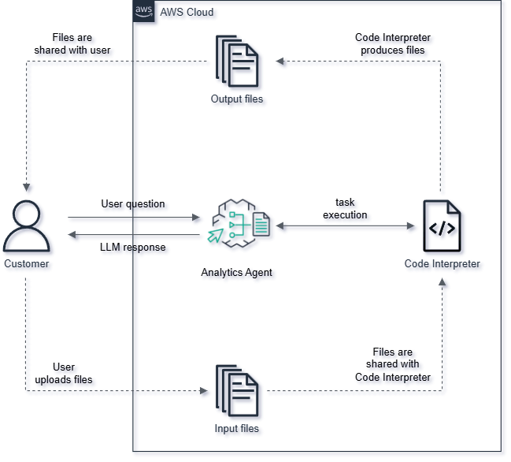

# **Amazon Bedrock Agent Workshop: Integrating Code Interpretation Capabilities**  

#### **Overview**  

In this workshop, you will learn how to build, deploy, and use **Amazon Bedrock Agent** with **code interpretation and execution capabilities**. You will be guided step-by-step to set up the environment, configure access to Foundation Models, and create sample data for testing.  

Additionally, you will practice **interacting with the Agent**, enabling it to answer mathematical questions, process files, interpret source code, generate visual charts, and automatically create documentation.  

After completing the workshop, you will gain:  
✅ **In-depth understanding** of Amazon Bedrock and how to build a Bedrock Agent.  
✅ **Deployment skills** to create an Agent capable of interpreting and executing code.  
✅ **Integration capabilities** to incorporate Bedrock Agent into real-world applications.  
✅ **Knowledge of cost optimization** and efficient resource management.  

Let’s dive into exploring **Amazon Bedrock Agent** and its potential! 🚀  

#### Agenda

1. [Introduction to Amazon Bedrock Agent](1-theory)
2. [Prerequisites](2-prerequisites)
3. [Deploying Amazon Bedrock Agent](3-developing-amazon-bedrock-agent)
4. [Invoking the Agent](4-invoking-agent)
5. [Resource Cleanup](5-resource-clean-up)
6. [Conclusion](6-conclusion)