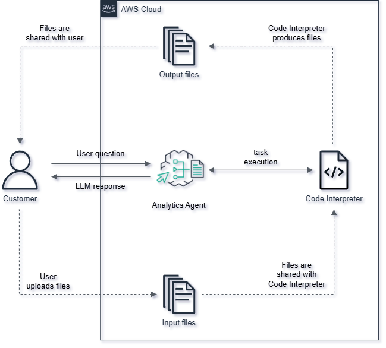

# **Amazon Bedrock Agent Workshop: Tích hợp khả năng biên dịch Code**  

#### **Tổng quan**  

Trong workshop này, bạn sẽ tìm hiểu cách xây dựng, triển khai và sử dụng **Amazon Bedrock Agent** với khả năng **biên dịch và thực thi code**. Bạn sẽ được hướng dẫn từng bước để thiết lập môi trường, cấu hình truy cập các Foundation Models và tạo dữ liệu mẫu để thử nghiệm.  

Bên cạnh đó, bạn sẽ thực hành cách **tương tác với Agent**, giúp nó trả lời các câu hỏi toán học, xử lý file, diễn giải mã nguồn, tạo biểu đồ trực quan và tự động tạo tài liệu.  

Sau khi hoàn thành workshop, bạn sẽ có được:  
✅ **Hiểu biết sâu** về Amazon Bedrock và cách xây dựng Bedrock Agent.  
✅ **Kỹ năng triển khai** một Agent có khả năng biên dịch và thực thi code.  
✅ **Khả năng tích hợp** Bedrock Agent vào các ứng dụng thực tế.  
✅ **Kiến thức về tối ưu hóa chi phí** và cách quản lý tài nguyên hiệu quả.  

Hãy cùng bắt đầu khám phá **Amazon Bedrock Agent** và những tiềm năng mà nó mang lại! 🚀  

#### Nội dung

1. [Giới thiệu Amazon Bedrock Agent](1-theory)
2. [Chuẩn bị](2-prerequisites)
3. [Triển khai Amazon Bedrock Agent](3-developing-amazon-bedrock-agent)
4. [Thực thi Agent](4-invoking-agent)
5. [Dọn dẹp tài nguyên](5-resource-clean-up)
6. [Kết luận](6-conclusion)
